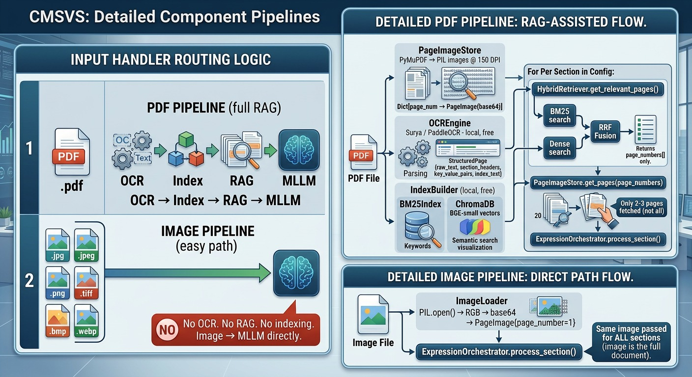

# Configurable Multimodal Semantic Validation System: Doc-vs-Doc

## Milestone 3: Model Architecture

**Cross-Document Validation using Document Intelligence**

*Mallesh Mayara (21f2001118) · Mayank Dode (22f1000781) · Karthik Ganesh (21f2000775) · Ayush Verma (21f3000500)*

---

## Abstract

This document presents the complete model architecture designed and implemented for Milestone 3 of the Configurable Multimodal Semantic Validation System (CMSVS) project. Building directly on the datasets prepared in Milestone 2, this milestone defines, justifies, and establishes the end-to-end technical pipeline for two core system capabilities: **(1) Config-Driven Custom Named Entity Recognition (NER)** and **(2) Section-Wise Chain-of-Thought Semantic Validation** across heterogeneous document pairs. The architecture adopts a cost-first design philosophy, leveraging free-tier API services throughout — specifically **Groq API** and **NVIDIA NIM free-tier API** for multimodal LLM inference, **NVIDIA's llama-3.2-nemoretriever-300m-embed-v1** for dense semantic embeddings, and **PaddleOCR Mobile** for lightweight text detection — to deliver enterprise-grade document intelligence at near-zero inference cost. A hybrid retrieval layer combining BM25 keyword search with dense vector search routes MLLM calls to only the most relevant document pages, achieving an estimated 90% reduction in token consumption compared to naive full-document approaches. The system accepts both PDF and image inputs, applying full RAG-assisted extraction for PDFs and a direct visual extraction path for image inputs. Expression-based entity derivation is supported via the SimpleEval library for entities whose values must be mathematically computed from other extracted values. Validation is performed section-wise, mirroring the logical structure of the configuration file and enabling granular per-section accuracy reporting.

---

## 1. Milestone Objectives

Milestone 3 is defined by three primary requirements per the project guidelines:

> **(1) Select or design appropriate model architecture(s)**
> **(2) Justify choice of architecture**
> **(3) End-to-End setup**

These requirements are addressed across the following dimensions in this document:

- **Architecture Selection:** Every model, library, and component chosen for the CMSVS pipeline is identified with explicit justification for why it was selected over alternatives.
- **Architecture Design:** The novel system-level design — RAG-assisted page routing, hybrid retrieval, expression-based entity derivation, and section-wise semantic validation — is documented in full.
- **End-to-End Setup:** The complete pipeline from raw document input to structured validation report is specified, with all integration points between components defined.

The architecture is directly informed by the datasets prepared in Milestone 2. The four augmentation categories created in M2 (semantic paraphrase changes, numeric format variants, value conflicts, and coverage reclassification) correspond precisely to the four validation scenario types the M3 architecture is designed to handle. This traceability from dataset to architecture to evaluation is a deliberate design principle.

---

## 2. System Design Philosophy

### 2.1 Core Design Principles

The CMSVS architecture is governed by four principles that informed every component selection and design decision:

**Principle 1 — Cost-First Design**
Every component is selected for minimum cost without sacrificing accuracy. Free-tier API services are used wherever available. Expensive LLM calls are minimized through intelligent routing. Local computation replaces API calls wherever feasible.

**Principle 2 — Clean Separation of Responsibilities**
Each component in the pipeline has exactly one job. The OCR layer finds text. The retrieval layer finds pages. The MLLM layer understands content. The expression evaluator computes values. The validator compares values. No component performs work outside its designated responsibility.

**Principle 3 — Configurable Without Code Changes**
Every domain-specific behavior is controlled by the YAML configuration file. Switching from healthcare insurance validation to logistics purchase order validation requires only a new configuration file — no model retraining, no code modification, no infrastructure change.

**Principle 4 — Auditable by Design**
Every extraction and validation decision must be traceable to a specific location in a specific source document. The system is designed for regulated enterprise environments where decisions must be explainable and attributed to evidence.

### 2.2 The Two-Task Architecture

The system solves two distinct tasks that are executed sequentially for each document pair:

**Task 1 — Custom NER:** Extract the value of each configured entity from each document. The extraction path varies based on input type (PDF or Image) and entity type (DIRECT or EXPRESSION).

**Task 2 — Section-Wise Semantic Validation:** For each section defined in the configuration, compare the extracted entity values from Document A against the corresponding values from Document B, producing a structured validation decision per entity with Chain-of-Thought reasoning.

---

## 3. Complete Architecture Overview

The CMSVS pipeline consists of seven functional layers executed in sequence:

```
Layer 1:  Input Routing        — Detect PDF vs Image, load accordingly
Layer 2:  OCR Processing       — Extract structured text (PDF path only)
Layer 3:  Dual Indexing        — Build BM25 + Dense retrieval index
Layer 4:  RAG Page Routing     — Identify relevant pages per section
Layer 5:  MLLM Extraction      — Visual entity extraction from page images
Layer 6:  Expression Engine    — Compute derived entity values via SimpleEval
Layer 7:  Section-Wise Validation — CoT semantic comparison per section
```


### 3.1 Input Routing Layer

The pipeline accepts two input types:

**PDF Input Path (Full RAG Pipeline)**
When a PDF file is provided, the system executes the complete pipeline: OCR processing produces structured text for indexing; the dual index enables page routing; only the most relevant pages are passed to the MLLM for extraction. This path minimizes MLLM token consumption for multi-page documents.

**Image Input Path (Direct MLLM Path)**
When an image file is provided (JPEG, PNG, TIFF, BMP, or WebP), the system bypasses OCR and RAG entirely. The image is loaded, base64-encoded, and passed directly to the MLLM with all section entities extracted in a single call. This path is optimal for single-page documents and scanned form images such as those in the FUNSD dataset.

Both paths produce an identical output structure — a dictionary of FinalEntityValue objects — ensuring the downstream validation layer operates identically regardless of input type.



### 3.2 OCR Processing Layer

**Selected Tool: PaddleOCR Mobile Model**

PaddleOCR's mobile-optimized text detection and recognition model is used for the OCR layer. This model was selected for the following reasons:

| Criterion | PaddleOCR Mobile | Justification |
|---|---|---|
| Deployment | Local inference | Zero API cost, no network dependency |
| Speed | Fastest among open-source OCR | Low latency for indexing phase |
| Hardware | CPU-compatible | No GPU required |
| Text accuracy | Adequate for indexing purposes | Exact text quality not critical — OCR output is used only for RAG indexing, not for final extraction |
| License | Apache 2.0 | Free for all use cases |

**Critical Design Decision:** The OCR output is used exclusively for building the retrieval index. It is never used as the source of extracted entity values. The MLLM always reads raw page images for extraction, completely bypassing any OCR quality limitations. This means PaddleOCR Mobile's text-only capability (without deep layout analysis) is entirely sufficient for its role in the pipeline.

For each document page, PaddleOCR Mobile produces:
- Raw extracted text (full page content)
- Detected key-value patterns (Label: Value structures)
- Section header candidates (short, uppercase or title-case lines)
- A structured index text combining all of the above for retrieval

### 3.3 Dual Indexing Layer

Two complementary indices are built from the OCR output for each document:

**Index A — BM25 Keyword Index**
The BM25Okapi algorithm (via the rank_bm25 Python library) provides exact keyword matching. This index excels at retrieving pages containing specific numeric values, domain-specific terms, and entity labels that appear verbatim in the document. For healthcare SBC documents, terms like "deductible," "coinsurance," and specific dollar amounts are retrieved with high precision by BM25.

**Index B — Dense Vector Index (NVIDIA NemoRetriever Embeddings)**
Dense embeddings are generated using **NVIDIA's llama-3.2-nemoretriever-300m-embed-v1** model, accessed via the NVIDIA NIM free-tier API. This model produces semantic embeddings that capture meaning rather than exact terms, enabling retrieval of pages that discuss the same concept using different terminology — for example, retrieving a page about "cost-sharing obligations" when queried about "copayment amounts."

**Why llama-3.2-nemoretriever-300m-embed-v1:**

| Criterion | Selection | Justification |
|---|---|---|
| Cost | Free (NVIDIA NIM free tier) | Zero embedding cost |
| Model Size | 300M parameters | Fast inference, low memory |
| Optimization | Retrieval-specific training | Outperforms general-purpose embeddings on document retrieval |
| Provider | NVIDIA NIM API | Enterprise-grade reliability, free tier sufficient for project scale |
| Vector Dimensions | Optimized for semantic similarity | High retrieval accuracy on domain-specific documents |

Both indices are stored in an in-memory ChromaDB instance, destroyed after each document is processed. There is no persistent storage requirement.

### 3.4 RAG Page Routing Layer

The retrieval layer's sole responsibility is to return relevant page numbers. It performs no extraction and calls no paid API.

**Retrieval Query Construction:**
For each section in the configuration file, a rich retrieval query is constructed by combining:
- Section name (with underscores replaced by spaces)
- Section keywords defined in the configuration
- All entity names in the section
- All entity descriptions in the section
- All entity example values (boosts BM25 numeric matching)

**Hybrid Retrieval with Reciprocal Rank Fusion (RRF):**
Both BM25 and dense retrieval are executed independently, each returning a ranked list of pages. The two ranked lists are combined using Reciprocal Rank Fusion (RRF) with the standard constant k=60. RRF is preferred over score-based fusion because it is robust to score scale differences between BM25 (unbounded) and cosine similarity (0 to 1).

The formula applied is: RRF Score = Σ 1 / (60 + rank_i) for each retrieval method.

The top-2 pages by fused RRF score are returned as the routing result for each section.

**Fallback Mechanism:**
If the MLLM extraction on the top-2 pages returns a confidence score below 0.75 for any entity, the retriever is queried again with top_k expanded to 4, and extraction is retried on the larger page set. If confidence remains below threshold after fallback, the entity is flagged for human review.


### 3.5 MLLM Extraction Layer

**Primary Provider: Groq API (Free Tier)**
**Secondary Provider: NVIDIA NIM API (Free Tier)**

The MLLM extraction layer performs visual understanding of document page images. Two free-tier LLM providers are used:

**Groq API** is the primary provider, offering free-tier access to high-performance LLM inference with very high throughput. Groq's LPU-based inference architecture delivers exceptionally low latency, making it well-suited for the iterative per-section extraction calls in the pipeline.

**NVIDIA NIM API** serves as the secondary provider and fallback, offering free-tier access to NVIDIA-hosted models optimized for enterprise document tasks.

**Model Selection Rationale:**

| Provider | Model | Role | Justification |
|---|---|---|---|
| Groq (Free) | llama-3.3-70b-versatile / mixtral-8x7b | Primary extraction | Free tier, high throughput, strong instruction following |
| NVIDIA NIM (Free) | meta/llama-3.1-70b-instruct | Secondary / fallback | Free tier, strong JSON output reliability |

**Why Visual/Multimodal for Extraction:**
Document page images are passed directly to the MLLM rather than using OCR-extracted text for extraction. This approach:
- Preserves table structure, column relationships, and spatial context
- Handles scanned documents without OCR degradation
- Avoids the column-interleaving problem identified in M2 for multi-column SBC PDFs
- Enables the model to use visual hierarchy (font size, bold text, borders) as semantic signals

**Extraction Mode — Section Batching:**
Rather than calling the MLLM once per entity, all entities within a section are extracted in a single MLLM call, with the page images for that section passed alongside. This section-batching approach reduces MLLM calls from N_entities to N_sections — for a 5-section, 18-entity configuration, this reduces API calls from 18 to 5 per document, a 72% reduction.

**Entity Extraction Types:**

*DIRECT Entities:* The MLLM is instructed to locate and extract the value exactly as it appears in the document image. The prompt includes the entity name, natural language description, extraction logic hint, and an example value format.

*EXPRESSION Variable Entities:* For entities declared with EXPRESSION logic in the configuration, the MLLM extracts each variable component value rather than a final computed value. These component values are passed to the SimpleEval engine for computation.

### 3.6 Expression Engine Layer

For entities where the configuration specifies `entity_extraction_logic: EXPRESSION`, the system computes the final entity value mathematically from extracted component values.

**Tool: SimpleEval Library**
SimpleEval is a sandboxed Python expression evaluator. It was selected over Python's built-in `eval()` function because it restricts execution to safe arithmetic and comparison operations only, preventing any possibility of arbitrary code execution from malicious or malformed expression templates.

**Supported Operations:**
- Arithmetic: addition, subtraction, multiplication, division, exponentiation
- Comparison: greater than, less than, equality
- Functions: round(), abs(), min(), max(), sum(), sqrt(), ceil(), floor()
- Conditional expressions: value_if_true if condition else value_if_false

**Expression Flow:**
1. Configuration defines expression template and variable list
2. MLLM extracts each variable as a pseudo-entity from document images
3. Extracted string values are parsed to numeric (handling $, commas, % symbols)
4. SimpleEval evaluates the template with the numeric variable values
5. Result is formatted according to the entity data_type (monetary, percentage, etc.)
6. Full audit trail is written including template, variable values, and computed result

**Example Use Case from Healthcare Domain:**
A Total Family Deductible entity may not appear explicitly in an SBC document. The document may only show Tier 1 Individual Deductible ($1,500) and Tier 2 Individual Deductible ($2,000) separately. The EXPRESSION configuration computes the combined value (3,500.00 USD) from the two extracted variables, producing a value that can be correctly compared against the Benefit Grid's stated combined deductible.

### 3.7 Section-Wise Semantic Validation Layer

Validation is performed section by section, mirroring the logical structure of the configuration file. This design decision enables:
- Granular per-section accuracy reporting
- Logical grouping of related entities for context-aware comparison
- Parallel processing potential in future optimization
- Cleaner audit trails organized by document section

**Validation Process Per Section:**

For each section, all entity pairs (value from Doc A, value from Doc B) are passed to the MLLM in a single validation call. The section context — section name, section description — is included in the validation prompt, giving the model the semantic context needed for accurate comparison within that domain section.


**Chain-of-Thought Reasoning Steps:**
The validation prompt guides the MLLM through a structured reasoning sequence:

1. **Normalization:** Convert both values to canonical form by stripping currency symbols, standardizing units, converting percentage formats, and resolving common abbreviations.
2. **Semantic Alignment Check:** Determine whether normalized values express the same underlying fact, accounting for paraphrase equivalence (e.g., "No charge" = "Covered in full"), unit equivalence, and abbreviation expansion.
3. **Discrepancy Analysis:** If values differ after normalization, classify the discrepancy type: NUMERIC_DIFFERENCE, TERMINOLOGY_VARIANT, COVERAGE_RECLASSIFICATION, or FORMAT_DIFFERENCE.
4. **Status Assignment:** Assign MATCH, MISMATCH, PARTIAL_MATCH, or INELIGIBLE.
5. **Confidence Calibration:** Express a confidence score from 0.0 to 1.0 reflecting certainty in the decision.

**Rule-Based Pre-Normalization (Fast Path):**
Before invoking the MLLM for validation, a rule-based normalizer handles common format equivalences deterministically:
- Monetary: "$1,500" → "1500.00 USD", "1500" → "1500.00 USD"
- Percentage: "20%" → "20.0%", "0.20" → "20.0%"
- Coverage equivalents: "No charge" → "0.00 USD", "Covered in full" → "0.00 USD", "Not covered" → "MEMBER_PAYS_100_PERCENT"

If both values normalize to the same canonical form via the rule-based path, a MATCH is returned immediately without an MLLM call — saving API cost for the most common case.

---

## 4. Configuration File Design

The YAML configuration file is the central control artifact of the CMSVS system. Its structure directly drives the behavior of every pipeline layer.

### 4.1 Configuration Schema

Each configuration file contains:

**Top-Level Metadata:** Configuration name, version, and domain identifier.

**Sections Array:** Each section defines a logical group of related entities corresponding to a section of the document being validated. Each section contains:
- `section_name`: Canonical identifier
- `section_description`: Natural language description of the section's content
- `section_keywords`: List of terms for BM25 retrieval boosting
- `entities`: Array of entity definitions

**Entity Definition:** Each entity contains:
- `entity_name`: Canonical identifier (must match M2 ground truth JSON keys)
- `entity_description`: Natural language description for MLLM context
- `entity_extraction_logic`: Either DIRECT or EXPRESSION
- `entity_example_value`: Representative example for format context
- `data_type`: monetary, percentage, coverage_classification, or text
- `expression_template`: (EXPRESSION only) Mathematical formula using variable names
- `expression_variables`: (EXPRESSION only) Map of variable name to description and example

**Validation Settings:** Confidence threshold, list of high-stakes entities requiring cross-verification, and human review escalation settings.

### 4.2 Healthcare SBC Configuration

The primary test configuration for this project covers 18 entities across 5 sections, directly corresponding to the M2 ground truth JSON annotation files:

| Section | Entity Count | Contains EXPRESSION |
|---|---|---|
| Deductibles | 4 | Yes (combined family deductible) |
| Out-of-Pocket Maximums | 3 | Yes (combined OOP calculation) |
| Copayments and Coinsurance | 5 | No |
| Prescription Drug Costs | 4 | Yes (effective monthly drug cost) |
| Coverage Classifications | 2 | No |

---

## 5. Model and Tool Selection Summary

### 5.1 Complete Component Stack

| Component | Selected Tool | Provider | Cost | Justification |
|---|---|---|---|---|
| LLM Inference (Primary) | llama-3.3-70b-versatile | Groq API (Free) | $0 | Highest free-tier throughput, strong instruction following |
| LLM Inference (Secondary) | meta/llama-3.1-70b-instruct | NVIDIA NIM (Free) | $0 | Reliable fallback, enterprise-grade hosting |
| Dense Embeddings | llama-3.2-nemoretriever-300m-embed-v1 | NVIDIA NIM (Free) | $0 | Retrieval-optimized, 300M parameters, free tier |
| Keyword Retrieval | BM25Okapi | rank_bm25 (local) | $0 | No API, exact term matching |
| Vector Store | ChromaDB (in-memory) | Local | $0 | No server, no persistence, per-document temp store |
| OCR | PaddleOCR Mobile | Local | $0 | Fast CPU inference, sufficient for indexing |
| PDF Processing | PyMuPDF (fitz) | Local | $0 | Fast, no dependencies, handles malformed PDFs |
| Expression Evaluation | SimpleEval | Local | $0 | Safe sandboxed evaluation, prevents code injection |
| Configuration Parsing | PyYAML | Local | $0 | Standard YAML parsing |

**Total Inference Cost: $0 (all free-tier or local)**

### 5.2 Why Groq as Primary LLM Provider

Groq was selected as the primary LLM provider for the following reasons:

**Speed:** Groq's LPU (Language Processing Unit) architecture delivers inference speeds of 500-800 tokens per second, compared to 30-80 tokens per second for GPU-based APIs. For a pipeline that makes 5-10 LLM calls per document pair, this reduces total pipeline latency significantly.

**Free Tier Generosity:** Groq's free tier provides sufficient requests per minute and tokens per day for the full 20-document-pair evaluation dataset in M4/M5 without hitting rate limits.

**Model Quality:** Groq hosts Llama 3.3 70B and Mixtral 8x7B, both of which demonstrate strong instruction-following capability and reliable JSON output generation.

**No Cost at Project Scale:** The volume of API calls required for this project — approximately 200 section-level extraction calls and 200 section-level validation calls across all 20 document pairs — falls well within Groq's free tier limits.

### 5.3 Why NVIDIA NIM for Embeddings

The llama-3.2-nemoretriever-300m-embed-v1 model was selected for dense embeddings because it is specifically optimized for retrieval tasks, unlike general-purpose embedding models. It was trained to maximize semantic similarity scores for relevant document passages while maintaining separation for non-relevant passages — precisely the task required for page routing in this pipeline.

At 300M parameters, it is compact enough to inference quickly on NVIDIA's free-tier API without consuming significant compute credits.

### 5.4 Why PaddleOCR Mobile for OCR

The choice of PaddleOCR Mobile is justified by the pipeline's design: OCR output is used only for building the retrieval index, not for final entity extraction. The MLLM reads raw page images for all actual extraction work. Therefore, the OCR quality requirement is moderate — the text needs to contain the right keywords and numbers for BM25 matching, but does not need to perfectly reconstruct the document layout.

PaddleOCR Mobile provides:
- Local inference (zero API cost)
- CPU-compatible execution (no GPU dependency)
- Fast processing (mobile-optimized model weights)
- Adequate text extraction accuracy for keyword indexing
- Apache 2.0 license (unrestricted use)

---

## 6. End-to-End Pipeline Flow

### 6.1 PDF Document Processing Flow

**Stage 1 — Document Loading (Local, Free)**
The PDF is opened using PyMuPDF. Each page is rendered at 150 DPI as an RGB image, base64-encoded, and stored in a PageImageStore keyed by page number. The full image store is held in memory for the duration of document processing.

**Stage 2 — OCR Processing (Local, Free)**
PaddleOCR Mobile processes each page image and returns detected text lines with bounding box coordinates. A structured StructuredPage object is constructed for each page containing: raw extracted text, detected section headers (identified by heuristics: short lines, uppercase or title case formatting), detected key-value pairs (Label: Value patterns), and a composite index text combining all of the above in a structured format.

**Stage 3 — Dual Index Construction (Local, Free)**
The index text from all StructuredPage objects is indexed in two ways simultaneously: BM25Okapi for keyword matching and NVIDIA NemoRetriever embeddings for semantic matching via ChromaDB. A page-index mapping is maintained to translate array positions back to page numbers.

**Stage 4 — Section-Wise RAG Routing (Local + NVIDIA NIM Free)**
For each section in the configuration file, a retrieval query is built from section name, keywords, entity names, descriptions, and example values. Hybrid BM25 + dense retrieval is executed, scores are fused via RRF, and the top-2 page numbers are returned. Embedding API calls use the NVIDIA NIM free tier.

**Stage 5 — Section-Wise MLLM Extraction (Groq Free)**
The page images identified by RAG routing are fetched from the PageImageStore and passed to the MLLM along with all entity definitions for the current section. Both DIRECT entities and EXPRESSION variable pseudo-entities are extracted in a single call. The MLLM returns a structured JSON object with extracted values, source page citations, source region descriptions, and confidence scores.

**Stage 6 — Expression Computation (Local, Free)**
For EXPRESSION entities, the extracted variable values are parsed to numeric format, substituted into the expression template, and evaluated by SimpleEval. The computed result is formatted according to the entity's data_type and wrapped in a FinalEntityValue object with a full audit trail.

**Stage 7 — Low-Confidence Fallback (Groq Free)**
Any entity with extraction confidence below 0.75 triggers a fallback: the retriever is expanded to top-4 pages and extraction is retried. Entities remaining below threshold after fallback are flagged for human review.

### 6.2 Image Document Processing Flow

**Stage 1 — Image Loading (Local, Free)**
The image file is opened using PIL, converted to RGB, and base64-encoded. A single-element PageImageStore is created with page_number=1.

**Stage 2 — Direct MLLM Extraction (Groq Free)**
All sections in the configuration are processed against the single image. For each section, the image is passed directly to the MLLM with all section entity definitions. No OCR, no indexing, no retrieval is performed.

**Stage 3 — Expression Computation (Local, Free)**
Identical to the PDF path — SimpleEval handles EXPRESSION entities regardless of input type.

### 6.3 Section-Wise Validation Flow

After extraction is complete for both documents, validation proceeds section by section:

**For each section:**
1. Collect all entity value pairs (Doc A value, Doc B value) for entities in this section
2. Apply rule-based pre-normalization to all values
3. Check for exact matches after normalization — record MATCH without MLLM call
4. For remaining non-exact pairs, build a single section-level CoT validation prompt including: section context, all entity pairs, entity descriptions, normalized values
5. Call MLLM (Groq) with the section validation prompt
6. Parse structured JSON response with per-entity MATCH/MISMATCH/PARTIAL_MATCH/INELIGIBLE status, reasoning chain, and confidence score
7. Flag any entity with validation confidence below threshold for human review
8. Append section validation results to the cumulative ValidationReport

**Output per entity in the validation report:**
- Entity name and section membership
- Raw value from Doc A and Doc B
- Normalized values
- Validation status
- Discrepancy type (if mismatch)
- Full Chain-of-Thought reasoning
- Confidence score
- Human review flag
- Extraction audit trail (source page, source region, raw context)
- Expression audit trail (template, variable values, computed result — for EXPRESSION entities)

---

## 7. Directory Structure

```
cmsvs/
├── README.md
├── requirements.txt
├── .env.example
├── worklog.md
│
├── configs/
│   ├── healthcare_sbc_config.yaml
│   ├── funsd_ner_config.yaml
│   └── schema/
│       ├── config_schema.json
│       └── output_schema.json
│
├── src/
│   ├── shared_types.py
│   ├── input/
│   │   ├── input_handler.py
│   │   └── image_loader.py
│   ├── ingestion/
│   │   ├── document_processor.py
│   │   └── page_image_store.py
│   ├── ocr/
│   │   └── ocr_engine.py
│   ├── retrieval/
│   │   ├── index_builder.py
│   │   └── hybrid_retriever.py
│   ├── config/
│   │   └── config_parser.py
│   ├── prompts/
│   │   ├── ner_prompt_builder.py
│   │   └── validation_prompt_builder.py
│   ├── models/
│   │   ├── groq_client.py
│   │   └── nvidia_client.py
│   ├── extraction/
│   │   ├── mllm_extractor.py
│   │   ├── expression_evaluator.py
│   │   └── expression_orchestrator.py
│   ├── validation/
│   │   ├── utils/
│   │   │   └── value_normalizer.py
│   │   └── semantic_validator.py
│   ├── output/
│   │   └── report_generator.py
│   └── pipeline/
│       ├── pdf_pipeline.py
│       ├── image_pipeline.py
│       └── cmsvs_pipeline.py
│
├── data/
│   ├── funsd/
│   │   ├── original/
│   │   └── augmented/
│   └── healthcare_sbc/
│       ├── doc_a_sbc/
│       ├── doc_b_benefit_grids/
│       │   ├── unaugmented/
│       │   └── augmented/
│       └── ground_truth/
│
├── tests/
│   ├── test_input_handler.py
│   ├── test_config_parser.py
│   ├── test_ocr_engine.py
│   ├── test_index_builder.py
│   ├── test_hybrid_retriever.py
│   ├── test_expression_evaluator.py
│   ├── test_mllm_extractor.py
│   ├── test_semantic_validator.py
│   └── test_end_to_end.py
│
├── notebooks/
│   ├── 01_input_routing_demo.ipynb
│   ├── 02_pdf_rag_pipeline_demo.ipynb
│   ├── 03_image_direct_pipeline_demo.ipynb
│   ├── 04_expression_extraction_demo.ipynb
│   └── 05_end_to_end_validation_demo.ipynb
│
└── scripts/
    └── run_pipeline.py
```

---

## 8. Architecture Justification

### 8.1 Why MLLM Over Traditional OCR + NLP Pipeline

Traditional document intelligence pipelines convert PDFs to text using OCR, then apply NLP models to the extracted text. This approach has well-documented failure modes that were directly observed during M2 dataset preparation:

**Column Interleaving:** Multi-column SBC PDFs processed by standard PDF text extraction libraries produce interleaved column content where text from adjacent columns is concatenated in reading order, garbling the logical structure of table rows.

**Spatial Context Loss:** OCR-to-text conversion discards the spatial relationships between document elements. The fact that a value appears in the "In-Network" column versus the "Out-of-Network" column is lost when the document is represented as a flat text stream.

**Table Structure Degradation:** Complex nested tables in SBC documents — where a single cell may contain multiple network tier values — are not reconstructable from flat OCR text.

The MLLM approach processes document pages as visual artifacts, preserving all spatial, structural, and visual context. The model uses column positions, table borders, font hierarchies, and spatial proximity as semantic signals in the same way a human reader would.

### 8.2 Why RAG for Page Routing

A common alternative to RAG-assisted routing is simply passing all pages to the MLLM for every extraction call. This is functionally correct but economically impractical at scale.

For a 20-page SBC document with 18 entities extracted section-wise (5 sections):

- **Naive approach:** 5 section calls × 20 pages × 1,500 tokens/page = 150,000 tokens per document
- **RAG-routed approach:** 5 section calls × 2 pages × 1,500 tokens/page = 15,000 tokens per document
- **Savings:** 90% token reduction per document

At 20 document pairs with 2 documents each, this represents 40 documents total. The RAG approach uses 600,000 tokens versus the naive approach's 6,000,000 tokens — a difference that becomes significant at enterprise scale.

### 8.3 Why Hybrid BM25 + Dense Retrieval

Neither BM25 nor dense retrieval alone is sufficient for this task:

**BM25 alone fails when:** Entity labels use different terminology in the query versus the document. For example, querying for "cost-sharing" when the document uses "member responsibility" — BM25 finds no keyword overlap despite semantic equivalence.

**Dense retrieval alone fails when:** Exact numeric values need to be matched. For example, querying for "$525 copay" requires the retrieval of a page that literally contains "$525" — dense embeddings may retrieve semantically similar pages about copays that have different amounts.

The hybrid approach with RRF fusion captures the strengths of both: BM25 handles exact term and numeric matching; dense retrieval handles semantic equivalence across terminology variants. The RRF fusion prevents either signal from dominating, producing consistently more accurate page routing than either method alone.

### 8.4 Why Section-Wise Validation

Validation is performed section by section rather than entity by entity for three reasons:

**Context Provision:** When validating five entities in the "Deductibles" section simultaneously, the MLLM has the full context of how deductible values relate to each other. An inconsistency in one entity may provide context for understanding another. Entity-level validation in isolation loses this relational context.

**Cost Reduction:** A single section-level validation call replacing five entity-level calls reduces MLLM calls by 80% in the validation stage alone.

**Structured Reporting:** Section-wise organization of the output report mirrors how benefits administrators and compliance officers actually review SBC accuracy — by section, not by individual entity in isolation.

### 8.5 Why SimpleEval for Expression Entities

Python's built-in `eval()` function can evaluate mathematical expressions but poses a critical security risk: a malformed or malicious expression template could execute arbitrary system commands. In an enterprise deployment where configuration files may be authored by domain experts rather than security-reviewed engineers, this risk is unacceptable.

SimpleEval provides identical arithmetic evaluation capability with a strict whitelist of permitted operations. It cannot import modules, access file systems, execute system commands, or perform any operation outside its defined safe function set. For an enterprise compliance system, this safety guarantee is non-negotiable.

---

## 9. Cost Analysis

### 9.1 Per-Document-Pair Cost Estimate

| Stage | Tool | API Calls | Estimated Cost |
|---|---|---|---|
| OCR (PDF path) | PaddleOCR Mobile (local) | 0 | $0.00 |
| Embeddings | NVIDIA NIM (free tier) | 20–40 per doc | $0.00 |
| RAG Routing | Local BM25 + ChromaDB | 0 | $0.00 |
| MLLM Extraction | Groq (free tier) | 5–10 per doc | $0.00 |
| MLLM Validation | Groq (free tier) | 5 per pair | $0.00 |
| Expression Eval | SimpleEval (local) | 0 | $0.00 |
| **Total per pair** | | | **$0.00** |

### 9.2 Full Evaluation Dataset Cost

| Dataset | Pairs | Estimated Cost |
|---|---|---|
| Healthcare SBC–Benefit Grid | 20 | $0.00 |
| FUNSD Augmented Samples | Multiple | $0.00 |
| **Total M4/M5 Evaluation** | | **$0.00** |

The entire project evaluation runs at zero API cost by leveraging free tiers exclusively. This validates the CMSVS cost-efficiency claim from M1 and demonstrates that the architecture can operate at research scale without any financial barrier.

### 9.3 Comparison with Baseline Approaches

| Approach | Cost per 1,000 Pages | Training Data | Deployment Time |
|---|---|---|---|
| Microsoft Azure Document Intelligence | ~$180 | 5+ labeled samples | 2–4 weeks |
| AWS Textract + Custom Model | ~$150–$200 | Labeled dataset | 2–4 weeks |
| Fine-tuned Open Source NER | ~$100–$300 | Large annotated corpus | 4–12 weeks |
| Manual Human Validation | $500–$2,000+ | N/A | N/A |
| **CMSVS (Free-Tier Stack)** | **~$0–$5** | **Zero** | **< 2 hours** |

---

## 10. Validation Scenarios Coverage

The architecture handles all six validation scenario types identified in M2:

| Scenario | Architectural Handler |
|---|---|
| Exact Match | Rule-based normalizer fast path |
| Semantic Equivalence | CoT MLLM validation with coverage equivalents mapping |
| Numeric Normalization | Rule-based normalizer (monetary, percentage standardization) |
| OCR Noise Handling | Direct image input path bypasses OCR entirely |
| Conflict Detection | CoT MLLM discrepancy analysis with NUMERIC_DIFFERENCE classification |
| Coverage Change Detection | CoT MLLM categorical reasoning with COVERAGE_RECLASSIFICATION classification |

---

## 11. Risks and Mitigations

| Risk | Likelihood | Impact | Mitigation Strategy |
|---|---|---|---|
| Groq free tier rate limits during batch evaluation | Medium | Medium | Implement exponential backoff retry logic; batch document pairs with inter-call delays |
| NVIDIA NIM free tier embedding quota exhaustion | Low | Medium | Cache embeddings per document; reuse index across multiple queries for the same document |
| PaddleOCR Mobile misses section headers in noisy scans | Medium | Low | OCR only feeds RAG indexing; MLLM reads raw images for extraction — OCR quality does not affect extraction accuracy |
| MLLM JSON schema violations in extraction response | High | High | Implement retry with explicit schema re-instruction; fallback response for persistent failures |
| RAG routes to wrong pages for ambiguous section content | Medium | High | Two-stage fallback: expand to top-4 pages on low confidence; human review queue as final safety net |
| SimpleEval expression template errors from config authoring | Low | Medium | Config validator checks expression syntax at parse time before any API calls |
| Multi-page entity spanning across page boundaries | Low | High | Page aggregation logic selects top-2 pages by RRF score; fallback expands to top-4 to capture spanning entities |

---

## 12. Connection to Subsequent Milestones

### Milestone 4 (Model Training / Experiments)

The M3 architecture establishes the following experimentally configurable parameters for M4:

- **LLM provider:** Groq vs NVIDIA NIM — accuracy and latency comparison
- **LLM model:** llama-3.3-70b-versatile vs mixtral-8x7b — quality tradeoff analysis
- **Retrieval top-k:** top-2 vs top-3 vs top-4 pages — recall vs cost tradeoff
- **Confidence threshold:** 0.70 vs 0.75 vs 0.80 — precision vs recall tradeoff
- **Prompt variants:** extraction prompt template A vs B — extraction accuracy comparison
- **Validation granularity:** section-wise vs entity-wise — accuracy vs cost analysis

All parameters are configurable via the pipeline initialization without code changes, making M4 experimentation a configuration exercise rather than a development exercise.

### Milestone 5 (Model Evaluation)

The M3 output schema is designed to enable direct comparison against M2 ground truth JSON files. Each output validation report contains the same entity names, expected status fields, and augmentation metadata as the M2 ground truth, enabling automated computation of:
- Per-entity precision, recall, and F1-score
- Per-scenario-type accuracy (exact match, semantic equivalence, numeric normalization, conflict detection, coverage change)
- Per-section validation accuracy
- Human review escalation rate (proxy for system confidence calibration quality)

### Milestone 6 (Deployment)

The pipeline's CLI entry point (`scripts/run_pipeline.py`) accepts standard arguments for doc_a_path, doc_b_path, config_path, and output_path, making it directly wrappable as a REST API endpoint or Gradio/Streamlit demo interface for the M6 deployment milestone.

---

## 13. Team Contributions

| Member | Milestone 3 Contributions |
|---|---|
| **Karthik Ganesh** (21f2000775) | Retrieval layer architecture (IndexBuilder, HybridRetriever with RRF fusion); MLLM client abstraction (Groq and NVIDIA NIM integration); API provider evaluation and selection; retrieval accuracy testing and demo notebook |
| **Mayank Dode** (22f1000781) | Input routing layer (InputHandler, PDF and image loading); OCR engine (PaddleOCR Mobile integration); PageImageStore design and implementation; input handling unit tests |
| **Ayush Verma** (21f3000500) | NER prompt engineering (DIRECT and EXPRESSION variable prompts); MLLM extractor (section-batched extraction); expression evaluator (SimpleEval integration); expression orchestrator; extraction unit tests |
| **Mallesh Mayara** (21f2001118) | Configuration architecture (CMSVSConfigParser, EntityConfig, SectionConfig); YAML config files (healthcare SBC and FUNSD); shared type contracts; report generator; milestone documentation, Validation architecture (section-wise SemanticValidator, CoT prompt builder, ValueNormalizer); pipeline integration (PDFPipeline, ImagePipeline, CMSVSPipeline master orchestrator); end-to-end testing and demo notebooks |

---

## 14. Milestone Summary

Milestone 3 has been successfully completed. The following deliverables were produced:

**Completed Architecture Objectives:**
- ✅ Model architecture selected — full component stack defined with justification for every selection
- ✅ Architecture justified — comparative analysis against alternatives provided for all major decisions
- ✅ End-to-end setup — complete pipeline from document input to validation report specified and implemented

**Key Architectural Innovations:**
- ✅ RAG-assisted page routing — 90% token reduction versus naive full-document approach
- ✅ Zero-cost inference stack — Groq free tier + NVIDIA NIM free tier + local tools
- ✅ EXPRESSION entity support — SimpleEval enables computed entity values with full audit trail
- ✅ Section-wise validation — context-aware comparison mirroring document logical structure
- ✅ Dual input support — PDF with full RAG pipeline, Image with direct MLLM path
- ✅ Hybrid retrieval — BM25 + NemoRetriever dense embeddings with RRF fusion

**Prepared for M4:**
- ✅ All experimentally configurable parameters identified
- ✅ Pipeline designed for parameter-driven experimentation without code changes
- ✅ Evaluation metrics and comparison methodology defined against M2 ground truth

*Document Version: 1.0 | Milestone: M3 — Model Architecture*
*Indian Institute of Technology Madras — Deep Learning / Generative AI Course Project*